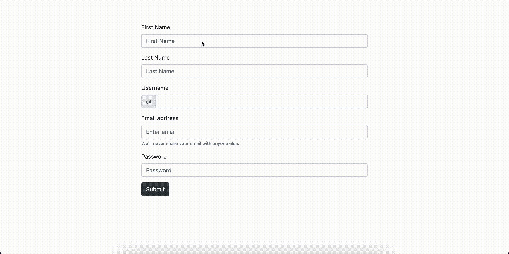

# Registration Form

Questa piccola applicazione è composta da due pagina. Quella principale 
presenta un form con dei campi da compilare. Una volta compilati si è 
registrati al database e successivamente inviati alla seconda pagina, 
nella quale è riportato il nome dell’utente, la sua email e il suo 
username.

Nella seconda pagina è anche presente la possibilità di fare logout.

Sono presenti tre classi: User, UserDAO, UserServlet.

La prima contiene metodi get/set per creare nuovi utenti e due 
costruttori.

La seconda ci permette di interagire con il database e la terza di gestire 
tutte le richieste dell’utente.

La VIEW è gestita da due pagine JSP, la prima in cui è presente il form e 
la seconda che ci mostra i risultati.

---

[User.java](http://User.java) - User model

```java
package model;

public class User {

	private String firstname;
	private String lastname;
	private String username;
	private String password;
	private String email;

	public User() {
	};

	public User(String firstname, String lastname, String username, 
String password, String email) {
		super();
		this.firstname = firstname;
		this.lastname = lastname;
		this.username = username;
		this.password = password;
		this.email = email;
	}

	public String getFirstname() {
		return firstname;
	}

	public void setFirstname(String firstname) {
		this.firstname = firstname;
	}

	public String getLastname() {
		return lastname;
	}

	public void setLastname(String lastname) {
		this.lastname = lastname;
	}

	public String getUsername() {
		return username;
	}

	public void setUsername(String username) {
		this.username = username;
	}

	public String getPassword() {
		return password;
	}

	public void setPassword(String password) {
		this.password = password;
	}

	public String getEmail() {
		return email;
	}

	public void setEmail(String email) {
		this.email = email;
	}

}
```

“Javabean” è il nome dato ad una classe che contiene almeno un costruttore 
vuoto e i metodi set/get con i quali impostare o prelevare valori. Questa 
classe ci servirà per creare ogni volta un nuovo utente.

---

[UserDAO.java](http://UserDAO.java) - User DAO

```java
package database;

import java.sql.Connection;
import java.sql.PreparedStatement;
import java.sql.SQLException;

import javax.naming.Context;
import javax.naming.InitialContext;
import javax.naming.NamingException;
import javax.sql.DataSource;

import model.User;

public class UserDAO {

	private static final String CONTEXT = "java:/comp/env";
	private static final String DATASOURCE = "jdbc/loginform";
	
	private static final String INSERT_USERS_SQL = "INSERT INTO users 
(firstname, lastname, username, password, email) VALUES (?,?,?,?,?)";

	protected Connection getConnection() throws NamingException, 
SQLException {
		Context initContext = new InitialContext();
		Context envContext = (Context) 
initContext.lookup(CONTEXT);
		DataSource dsconnection = (DataSource) 
envContext.lookup(DATASOURCE);
		return dsconnection.getConnection();
	}

	public void insertUser(User user) {

		try (Connection connection = getConnection();
				PreparedStatement preparedStatement = 
connection.prepareStatement(INSERT_USERS_SQL);) {

			preparedStatement.setString(1, 
user.getFirstname());
			preparedStatement.setString(2, 
user.getUsername());
			preparedStatement.setString(3, 
user.getUsername());
			preparedStatement.setString(4, 
user.getPassword());
			preparedStatement.setString(5, user.getEmail());
			preparedStatement.execute();

			System.out.println("success");

		} catch (Exception e) {
			e.printStackTrace();
		}

	};

}
```

La classe “DAO” è quella classe che contiene la logica che ci permette di 
relazionarci con il database.

Il metodo ‘getConnection’ ci permette di collegarci al database. La 
connessione effettiva avviene tramite l’utilizzo del 
[datasource](https://docs.oracle.com/cd/E19229-01/819-2783/agj2eres.html). 
Tutte le informazioni di accesso sono nel file context.xml di tomcat.

Una volta stabilita la connessione abbiamo bisogno di un singolo metodo 
per poter inserire l’utente una volta compilato il form:

```java
public void insertUser(User user) {

		try (Connection connection = getConnection();
				PreparedStatement preparedStatement = 
connection.prepareStatement(INSERT_USERS_SQL);) {

			preparedStatement.setString(1, 
user.getFirstname());
			preparedStatement.setString(2, 
user.getUsername());
			preparedStatement.setString(3, 
user.getUsername());
			preparedStatement.setString(4, 
user.getPassword());
			preparedStatement.setString(5, user.getEmail());
			preparedStatement.execute();

			System.out.println("success");

		} catch (Exception e) {
			e.printStackTrace();
		}

	};
```

Il metodo prende come argomento un oggetto di tipo user (ci servirà dopo 
nel servlet).

Nel blocco try sono presenti due argomenti, la connessione e la 
dichiarazione che vogliamo fare al database. Con dichiarazione intendiamo 
l’azione che vogliamo accada alla chiamata del metodo nel database. In 
questo caso l’inserimento di un nuovo utente. Sono presenti due argomenti 
nel blocco try poiché questa sintassi ci permette di chiudere 
automaticamente la connessione una volta terminati i processi nel metodo. 
Info 
[qui](https://docs.oracle.com/javase/tutorial/essential/exceptions/tryResourceClose.html#:~:text=The%20try%20%2Dwith%2Dresources%20statement%20is%20a%20try%20statement%20that,the%20end%20of%20the%20statement.).

Una volta stabilita la connessione e la dichiarazione dobbiamo definire i 
dati da aggiungere al database.

```java
preparedStatement.setString(1, user.getFirstname());
```

`.setString()` ci permette di selezionare la colonna del database con il 
primo argomento e come valore della colonna il secondo argomento del 
metodo. Quindi verrà impostato il valore di ‘firstname’ alla prima 
colonna.

Una volta finito mandiamo in esecuzione la dichiarazione con 
`preparedStatement.execute();` .

Stampiamo in consolle un messaggio di successo in caso di avvenuta 
connessione o di errore in caso di problemi.

---

[UserServlet.java](http://UserServlet.java) - User Servlet

```java
package servletHandler;

import java.io.IOException;
import javax.servlet.RequestDispatcher;
import javax.servlet.ServletException;
import javax.servlet.annotation.WebServlet;
import javax.servlet.http.HttpServlet;
import javax.servlet.http.HttpServletRequest;
import javax.servlet.http.HttpServletResponse;

import database.UserDAO;
import model.User;

/**
 * Servlet implementation class UserServlet
 */
@WebServlet("/")
public class UserServlet extends HttpServlet {
	private static final long serialVersionUID = 1L;

	public UserServlet() {

	}

	protected void doGet(HttpServletRequest request, 
HttpServletResponse response)
			throws ServletException, IOException {
		String action = request.getServletPath();
		if (action.equals("/logout")) {
			logout(request, response);
		}
	}

	protected void doPost(HttpServletRequest request, 
HttpServletResponse response)
			throws ServletException, IOException {

		String firstname = request.getParameter("firstname");
		String lastname = request.getParameter("lastname");
		String username = request.getParameter("username");
		String password = request.getParameter("password");
		String email = request.getParameter("email");
		User userNew = new User(firstname, lastname, username, 
password, email);

		try {
			UserDAO userDAO = new UserDAO();
			userDAO.insertUser(userNew);

			RequestDispatcher dispatcher = 
request.getRequestDispatcher("user-success.jsp");
			dispatcher.forward(request, response);

		} catch (Exception e) {
			e.printStackTrace();
		}

	}

	private void logout(HttpServletRequest request, 
HttpServletResponse response) throws ServletException, IOException {
		response.sendRedirect(request.getContextPath());
	};

}
```

Nel servlet abbiamo il compito di gestire le azioni dell’utente che 
possono essere di tipo ‘post’ quando l’utente invia qualcosa, o di tipo 
‘get’ quando l’utente chiede qualcosa.

Nel metodo ‘doGet’ il quale gestisce le chiamate get, è presente una 
stringa che ci permette di recuperare il valore scritto nell’azione, 
quindi la parte finale dell’url.

Con il costrutto if controlliamo se l’azione è uguale alla stringa 
‘/logout’. Nel caso lo fosse chiamerebbe il metodo omonimo che ci permette 
di creare un finto logout portandoci all’home page.

Il form nell’home page ci permette di prendere tutti i dati dell’utente. 
Questi dati vengono gestiti dal metodo ‘doPost’ del servlet. (il form ha 
come metodo “post”).

```java
protected void doPost(HttpServletRequest request, HttpServletResponse 
response)
			throws ServletException, IOException {

		String firstname = request.getParameter("firstname");
		String lastname = request.getParameter("lastname");
		String username = request.getParameter("username");
		String password = request.getParameter("password");
		String email = request.getParameter("email");
		User userNew = new User(firstname, lastname, username, 
password, email);

		try {
			UserDAO userDAO = new UserDAO();
			userDAO.insertUser(userNew);

			RequestDispatcher dispatcher = 
request.getRequestDispatcher("user-success.jsp");
			dispatcher.forward(request, response);

		} catch (Exception e) {
			e.printStackTrace();
		}
}
```

Il metodo ha due oggetti come argomenti, request e response.

Per prima cosa dobbiamo recuperare tutti i valori presenti nel form. 
Utilizziamo il metodo ‘getParameter’ indicando nell’argomento il nome 
associato all’attributo ‘name’ inserito nel tag input all’interno del 
form.

```html
<input name="firstname" required type="text" class="form-control" 
placeholder="First Name">
```

L’attributo name è presente in tutti tag input del form così da recuperare 
tutti i valori.

Una volta recuperati i valori dobbiamo creare un nuovo oggetto di tipo 
User da poter inviare al metodo nella classe DAO, il quale si occuperà di 
inviarlo al database.

Una volta creato dobbiamo avere un’istanza della classe DAO in modo da 
poter accedere al metodo ‘insertUser’ e inserire come argomento del metodo 
il nostro nuovo user.

Inviate le informazioni al database vogliamo essere trasferiti in una 
nuova pagina per visualizzare l’avvenuta condivisione con il database e 
alcune informazioni emesse dall’utente.
Lo facciamo creando un nuovo dispatcher con l’interfaccia 
RequestDispatcher la quale ci permette, con il metodo 
‘getRequestDispatcher’, di essere inviati ad un’altra risorsa. In questo 
caso alla pagina “user-success.jsp”.

Infine inviamo la risposta e la richiesta anche alla pagina di arrivo con 
il metodo ‘forward’.

---

“user-up.jsp” - Form Page

```html
<%@ page language="java" contentType="text/html; charset=UTF-8"
	pageEncoding="UTF-8"%>
<!DOCTYPE html>
<html>
<head>
<meta charset="UTF-8">
<link rel="stylesheet"
	
href="https://cdn.jsdelivr.net/npm/bootstrap@4.3.1/dist/css/bootstrap.min.css">
<link rel="icon" type="image/x-icon"
	
href="https://img.icons8.com/external-inipagistudio-mixed-inipagistudio/344/external-registration-form-online-therapy-inipagistudio-mixed-inipagistudio.png
">

<title>Registration Form</title>
</head>
<body>

	<div class="d-flex justify-content-center p-5 ">
		<form class="w-50 p-3" 
action="<%=request.getContextPath()%>/success"
			method="post">
			<div class="form-group">
				<label for="exampleInputPassword1">First 
Name</label> <input
					required type="text" 
class="form-control" placeholder="First Name"
					name="firstname">
			</div>
			<div class="form-group">
				<label for="exampleInputPassword1">Last 
Name</label> <input required
					type="text" class="form-control" 
placeholder="Last Name"
					name="lastname">
			</div>
			<div class="form-group">
				<label for="validationCustomUsername" 
class="form-label">Username</label>
				<div class="input-group has-validation">
					<span class="input-group-text" 
id="inputGroupPrepend">@</span> <input
						name="username" 
type="text" class="form-control"
						
id="validationCustomUsername" aria-describedby="inputGroupPrepend"
						required>
					<div 
class="invalid-feedback">Please choose a username.</div>
				</div>
			</div>
			<div class="form-group">
				<label for="exampleInputEmail1">Email 
address</label> <input
					required name="email" type="email" 
class="form-control"
					id="exampleInputEmail1" 
aria-describedby="emailHelp"
					placeholder="Enter email"> <small 
id="emailHelp"
					class="form-text text-muted">We'll 
never share your email
					with anyone else.</small>
			</div>
			<div class="form-group">
				<label 
for="exampleInputPassword1">Password</label> <input
					name="password" type="password" 
class="form-control"
					id="exampleInputPassword1" 
placeholder="Password" required>
			</div>
			<button type="submit" class="btn btn-primary 
btn-dark">Submit</button>

		</form>

	</div>

</body>
</html>
```

La pagina JSP contiene per la maggior parte HTML. Per velocizzare il 
layout è presente bootstrap.

---

“user-success.jsp” - Pagina finale

```html
<%@ page language="java" contentType="text/html; charset=UTF-8"
    pageEncoding="UTF-8"%>
<!DOCTYPE html>

<html>
<head>
<meta charset="UTF-8">
<link rel="icon" type="image/x-icon" 
href="https://img.icons8.com/external-inipagistudio-mixed-inipagistudio/344/external-registration-form-online-therapy-inipagistudio-mixed-inipagistudio.png
">
<link rel="stylesheet" 
href="https://cdn.jsdelivr.net/npm/bootstrap@4.3.1/dist/css/bootstrap.min.css">
<title>Registration completed</title>
</head>
<body>

<% 
String firstname = request.getParameter( "firstname" );
String upname = firstname.substring(0, 1).toUpperCase() + 
firstname.substring(1);
String username = request.getParameter( "username" );
String email = request.getParameter( "email" );
%>

<div class="d-flex flex-column justify-content-center align-items-center 
p-5">

<h4>Hi <%= upname %>, you registered with this email: <%= email %>.</h4>
<h5 class="p-2">Your username is: <%= username %></h5>

<h6 class="p-5 m-5 justify-content-start"><a 
href="<%=request.getContextPath()%>/logout"class="nav-link">Logout.</a></h6>

</div>
<body>
</body>
</html>
```

Ci è tornato molto utile utilizzare il metodo .forward() passando i due 
oggetti ‘request’ e ‘response’ nel servlet perché anche in un’altra pagina 
possiamo riferirci agli stessi dell’home page. Utilizzando, poi, il metodo 
‘getParameter’, possiamo recuperare le informazioni che ci servono.

Abbiamo recuperato tre parametri: firstname, username e email.
Successivamente li stampiamo così da mostrarli. 
Sono presenti vari metodi sulla stringa ‘firstname’ che ci permettono di 
avere sempre la prima lettere maiuscola. 

---

Impostare home page.

Possiamo definire, nel file web.xml presente nel server Tomcat, le home 
page per le nostre applicazioni.
Basterà inserire nel tag <welcome-file> il nome della pagina che vogliamo 
venga mostrata come home page.

```html
<welcome-file-list>
        <welcome-file>index.html</welcome-file>
        <welcome-file>index.htm</welcome-file>
        <welcome-file>index.jsp</welcome-file>
         <!-- <welcome-file> inserisci-nome-pagina-home-page.estensione 
</welcome-file> --> 
    </welcome-file-list>
```


